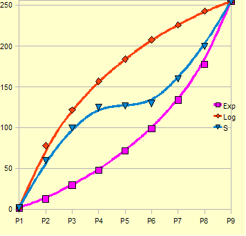

## <a name="MIDISpeed"></a>MIDI Speed
```
<MIDI Speed    >
<     USB+MIDI >
```
(Atmega (old) based MegaDrum only) It can be set to "USB+MIDI", "USB only 1",
"USB only 2", "USB only 3". "USB+MIDI" uses standard 31.25k MIDI speed and is
compatible with older PIC USB MIDI firmware. "USB only 1", "USB only 2" and
"USB only 3" switches the speed to 125k, 187.5k and 250k. Depending on the PCB
and soldering quality and chips samples not all "USB only x" will work properly.
Switching to higher speeds will only work with a newer version (21/04/2011) of
PIC USB MIDI firmware. Switching to higher USB MIDI speeds reduces overall
latency over USB by 0.5-1.5ms.

This is a Global setting so when you change this setting it is only saved in
no-volatile (EEPROM) memory when you exit the Menu. So, as a consequence, if you
change it and switch MegaDrum off straight away to test it without exiting the
Menu, it will revert to a previous state before the change.

## <a name="AutoLoadConf"></a>AutoLoad Configuration
```
<AutoLoad Conf >
<          No  >
```
When set to Yes, MegaDrum will automatically load last saved/loaded config and
drum map upon powering up. You can by pass auto loading config even if you set
it to Yes by hold the key RIGHT while switching MegaDrum on. It will then load
default settings.

This is a Global setting so when you change this setting between Yes and No the
setting is only saved in no-volatile (EEPROM) memory when you exit the Menu.
So, as a consequence, if you change it and switch MegaDrum off straight away to
test it without exiting the Menu, it will revert to a previous state before the
change.

## <a name="AltEncoders"></a>Alternative Encoders
```
<AltEncoders   >
<          No  >
```
MegaDrum can be used with two types of rotary encoders - one with one pulse per
detent, another with two pulses per detent. For encoders with one pulse per
detent set AltEncoders to No, for encoders with two pulses per detent set
AltEncoders to Yes. Before the encoders can function properly you first need to
set AltEncoders to a proper value with buttons only.

This is a Global setting so when you change this setting between Yes and No the
setting is only saved in no-volatile (EEPROM) memory when you exit the Menu. So,
as a consequence, if you change it and switch MegaDrum off straight away to test
it without exiting the Menu, it will revert to a previous state before the change.

## <a name="MaxInputs"></a>Maximum Number of Inputs
```
<MaxInputs     >
<           56 >
```
Here you can set the maximum number of inputs used. The lower the MaxInputs the
more Configs/DrumMaps you can save in non-volatile memory but it will limit you
to the number of inputs set here. When you change MaxInputs to a new number
don't try to load Configs/Drum Maps saved previously - it can cause MegaDrum to
misbehave.

This is a Global setting so when you change this setting it is only saved in
no-volatile (EEPROM) memory when you exit the Menu. So, as a consequence, if you
change it and switch MegaDrum off straight away to test it without exiting the
Menu, it will revert to a previous state before the change.

## <a name="ConfigNamesEn"></a>Enable Custom Configuration Names
```
<ConfigNamesEn >
<           No >
```
Enables/disables support for editable Custom Config Names.
Default is No (disabled). When set yo Yes, it enables support for editable
Custom Config Names and in this case MegaDrum uses more internal non-volatile
(EEPROM) memory for storing each Config thus reducing the number of Configs/Drum
Maps which can be saved. Custom Config Names themselves can only be changed via
SysEx messages, e.g. using MegaDrum Manager.

This is a Global setting so when you change this setting it is only saved in
no-volatile (EEPROM) memory when you exit the Menu. So, as a consequence, if you
change it and switch MegaDrum off straight away to test it without exiting the
Menu, it will revert to a previous state before the change.

## <a name="CustomNamesEn"></a>Enable Custom Pad Names
```
<CustomNamesEn >
<           No >
```
Enables/disables support for editable Custom Pads Names.
Default is No (disabled). When set yo Yes, it enables support for editable
Custom Pads Names and in this case MegaDrum uses more internal non-volatile
(EEPROM) memory for storing each Config thus reducing the number of Configs/Drum
Maps which can be saved. Custom Pads Names themselves can only be changed via
SysEx messages, e.g. using MegaDrum Manager. The editable Custom Pads names are
available as last 32/16/2 names in PadName->Name selection list. The number of
available editable Custom Pads Names depends on a chip used: Atmega1284 - 32
editable custom pads names, Atmega644 - 16, Atmega32/324 - 2.

This is a Global setting so when you change this setting it is only saved in
no-volatile (EEPROM) memory when you exit the Menu. So, as a consequence, if you
change it and switch MegaDrum off straight away to test it without exiting the
Menu, it will revert to a previous state before the change.

## <a name="MIDI2ForSysEx"></a>MIDI2ForSysEx
```
<MIDI2ForSysEx >
<           No >
```
(STM32 based MegaDrum only) When set to Yes the second USB MIDI Port will
transmit only SySex messages.
Default is No. This is implemented to prevent MIDI softs/synths listening on all
MIDI ports from receiving the same Note On/Off messages twice.

This is a Global setting so when you change this setting it is only saved in
no-volatile (EEPROM) memory when you exit the Menu. So, as a consequence, if you
change it and switch MegaDrum off straight away to test it without exiting the
Menu, it will revert to a previous state before the change.

## <a name="LoadROMKitMap"></a>Load ROM Kit/Map
```
<Load ROM Kit  >
<           No >

<Load ROM Map  >
<           No >
```
Loading predefined Kits/Drum Maps intended for MegaDrum newcomers to get a quick start.
As of now there are 3 predefined kits/maps: Default, Basic and Advanced.
Basic and Advanced kits/maps are developed by Anders (angr77) to match
Addictive Drums MegaDrum map and Anders' reference Basic and Advanced kits.

## <a name="CurrentConfig"></a>Current Configuration
```
<CurrentConfig >
<           1  >
```
Shows currently loaded/saved config used by MegaDrum.

## <a name="SaveConfig"></a>Save Configuration
```
<Save Config   >
<           No >
```
When on this screen you can save your current MegaDrum configuration into
non-volatile memory. You can save several configurations into different memory
slots. The number of Config slots depends on a type of Atmega  and the number of
inputs set in MaxInputs. Select a slot you want to save the configuration into
with keys UP/DOWN and then press the key RIGHT. After a few seconds it will show
'Done' indicating that the configuration has been saved.

## <a name="LoadConfig"></a>Load Configuration
```
<Load Config   >
<           No >
```
When on this screen you can load a previously saved MegaDrum configuration from
non-volatile memory. Select a slot you want to load the configuration from with
keys UP/DOWN and then press the key RIGHT. After a few seconds it will show
'Done' indicating that the configuration has been loaded.

## <a name="SaveDrumMap"></a>Save Drum Map
```
<Save DrumMap  >
<           No >
```
When on this screen you can save the current drum map into non-volatile memory.
Drum map is a mapping (matching) between pad inputs and notes assigned to those
pads. Select a slot you want to save the drum map to with keys UP/DOWN and then
press the key RIGHT. After a few seconds it will show 'Done' indicating that the
drum map has been saved. The number of DrumMap slots depends on a type of Atmega
and the number of inputs set in MaxInputs.

## <a name="LoadDrumMap"></a>Load Drum Map
```
<Load DrumMap  >
<           No >
```
When on this screen you can load a previously saved drum map from non-volatile
memory. Select a slot you want to load the drum map from with keys UP/DOWN and
then press the key RIGHT. After a few seconds it will show 'Done' indicating
that the drum map has been loaded.

## <a name="ChainID"></a>Chain ID
```
<SysEx ChainID >
<            0 >
```
When you use MegaDrumManager to control MegaDrum and have two (more?) modules
chained together over MIDI ports, you must assign different ChainIDs to each
module to be able to control each unit individually. Default ChainID is 0.

## <a name="SendConfSysEx"></a>Send SysEx Configuration
```
<Send ConfSysex>
<              >
```
From this screen you can manually force MegaDrum to send the full current
configuration as a set of SysEx MIDI messages. You may want to do it if you
cannot use MegaDrumManager and need to save the configuration externally using
e.g. MIDI-OX. You can later send the whole set of SysEx MIDI messages back to
MegaDrum, e.g. again using MIDI-OX, to apply saved configuration. While in this
screen press the key UP to send the configuration.

## <a name="MIDIThruEnabled"></a>MIDI Thru Enabled
```
<MIDIThru Enbld>
<           No >
```
Enable/disable MIDI Thru. By default it is set to No (disabled). When enabled
MegaDrum will send out all MIDI messages it receives over MIDI.

## <a name="NoteOffDelay"></a>NoteOff Delay
```
<NoteOff Delay >
<          200 >
```
This setting configures how many milliseconds should pass before a Note Off MIDI
message is sent after a previous Note On message. Can be set between 20 and 2000
milliseconds (0.02 - 2 seconds).

## <a name="PressRollTime"></a>PressRoll Time
```
<PressRoll Time>
<            0 >
```
Maximum time out in milliseconds between consecutive hits for "pressroll"
detection.  If a next hit follows a previous hit in less than this time out then
the note value for the hit will be taken from PNote (PBNote for 3rd zones) rather
than from Note or ANote (BNote or ABNote for 3rd zones). Can be set between 0
and NoteOff Delay value.

## <a name="Latency"></a>Latency
```
<Latency       >
<           40 >
```
This setting should have probably be called something like Group scan frequency.
Internally MegaDrum scans all inputs every 10-30 microseconds for presence of
signals. Then, very simplified, every <Latency> period MegaDrum scans inputs
states to see if any of the inputs registered signals and sends MIDI messages
for triggered inputs. Lowering this setting will reduce latency and may degrade
level detection precision. Raising this setting may improve level detection
precision and will increase latency. Latency can be changed between 10 and 100
which corresponds to 1 and 10 milliseconds. Default is 40 - 4 millisecond. Also
when it is set to an odd value (e.g. 21, 23, 25 and so on) it enables a visual
cue to see if pads Thresholds are set too low - when a pad is hit lightly but
not enough to exceed Threshold level the VU meter for the pad set to a maximum
but no MIDI signal is sent and the LED stays off. If VU meters start to go off
without pads being hit then Thresholds for corresponding inputs are set too low.

## <a name="OctaveShift"></a>Octave Shift
```
<OctaveShift   >
<           No >
```
It is used to make MegaDrum display all notes names in a desired octave. By
default it is set to 2 (maximum value). As an example, with the default
OctaveShift the default Kick note (36) will be shown as from octave 2.

## <a name="BigVUMeter"></a>Big VU Meter
```
<Big VU Meter  >
<           No >
```
When set to No (default) each of 32 blocks on an LCD is used as an individual
VU meter for every input. The resolution of each of these small VU meters is 16,
i.e. one bar per 16 adjacent MIDI levels giving 8 bars for 128 MIDI levels. The
resolution of the Big VU Meter is much better, approximately 100 bars for 128
MIDI levels. The next, 'Big VU Split', option determines what is shown in the
big VU meter.

## <a name="BigVUSplit"></a>Big VU Split
```
<Big VU Split  >
<           No >
```
When set to No (default) (and Big VU Meter is set to Yes) the whole top row of
the LCD is dedicated to HiHat pedal position and the whole bottom row of the LCD
shows hit levels from all inputs on a big single VU meter.
When set to Yes (and Big VU Meter is set to Yes) the whole top row shows hit
levels from all even (Head/Bow) inputs and the whole bottom row of the LCD shows
hit levels on odd (Rim/Edge) inputs. The HiHat pedal position is not shown in
this mode.

## <a name="QuickAccess"></a>Quick Access
```
<Quick Access  >
<           No >
```
When set to Yes you can quickly jump between inputs in the Menu rather than
navigate to each input using LEFT/RIGHT keys. First enter the Menu, then press
the HiHat pedal and then hit a pad you want to configure. Whenever you hit
another pad while still holding the HiHat pedal pressed and still in the Menu,
it will jump to the last hit pad input. You have to make a Splash
(quickly press/release the pedal) twice for Quick Access to become effective.
When set to No you can quickly load next/previous drum map by pressing keys
UP/DOWN while not in the Menu and holding the HiHat pedal pressed. May be useful
for live performances to quickly load different drum maps?

## <a name="TriggeredInCC"></a>Triggered In CC
```
<TriggeredInCC >
<           No >
```
When set to Yes and you hit a pad, MegaDrum will send a special MIDI CC message
telling exactly which input was triggered. This option allows MegaDrum Manager
(MDM) or MDCommander to quickly switch between inputs configs.

## <a name="AltFalseTrSupp"></a>AltFalseTrSupp
```
<AltFalseTrSupp>
<           No >
```
When set to Yes, MegaDrum uses alternative (old) algorithm for false triggering
suppression which was the default algorithm in firmware versions before the
version 20110703. It has an effect on XTalk/Retrigger/DynLvl/DynTime settings.

## <a name="InputsPriority"></a>Inputs Priority
```
<InputsPriority>
<           No >
```
When set to Yes the first 3/4th of Head/Bow inputs are given slightly higher
priority (sampled more often) then the rest of inputs.

## <a name="AltNoteChoking"></a>AltNote Choking
```
<AltNoteChoking>
<           No >
```
When set to Yes, AltNote from inputs settings is used for cymbals choking
instead of Aftertouch. When the choke switch is pressed, MegaDrum will send Note
On with AltNote note and when the switch is released MegaDrum will send Note Off
with AltNote note.

## <a name="NoiseFilter"></a>Noise Filter
```
<NoiseFilter   >
<            5 >
```
(STM32F205 based MegaDrum only). Noise Filtering level. Default is set 5.
Setting it too high may have negative effect on Positional sensing.

## <a name="PositionalIn"></a>Positional Input
```
<PositionalIn  >
<     SnareH 4 >
```
Selects which input the further 3 positional sensing settings (PositionalLv,
PositionalLow, PositionalHi) are to be configured for. You can choose SnareH (4),
RideH (6), CrushH (8) or Tom1H(10) here.

## <a name="PositionalLv"></a>Positional Lv
```
<PositionalLv  >
<           No >
```
Enables/disables Positional Sensing (PS) on a selected input. By default it is
disabled. To enable PS on a selected input set Positional to 1, 2 or 3
(corresponding to three variations of PS). The next two settings, PositionalLow
and PositionalHigh, need to be adjusted for the best PS accuracy. PositionalLow
and PositionalHigh are adjusted so that to get a full range of detected positions
(and MIDI CC messages) from a rim (PositionalLow) to a centre (PositionalHigh).
The default PositionalLow and PositionalHigh are good starting values for Roland
PD-125X with Positional set to 1.
When Positional set to 2 the good starting values for Roland PD-125x are ~16 and
~30. With Positional set to 2, MinScan must be set so that to cover a full half
wave which is ~30-40 (3-4ms) for Roland PD-125X.
Positional set to 3 is almost the same as 2 but with slightly different algorithm
so you may need to set PositionalLow and PositionalHigh slightly higher.
With PS enabled and LCD showing one of the PS settings, when hitting the snare
you can see in the botom left of the LCD the relative position of the hit as
calculated by MegaDrum: ^ symbol shown more to the left for centre hits and more
to the right for close to rim hits. You will also see the calculated PS value of
the hit for currently selected PS algorithm (1, 2 or 3) which you should use for
setting PositionalLow and PositionalHi properly.
As experimental feature it may or may not work for you.
There are a few requirements:

* it may work only with mesh type pads with a centrally positioned piezo.
* the pad must not be too hot. If it is too hot it must be "cooled" with a
voltage divider.
*the first half wave of a signal from a pad should be positive, e.g my Pintech
mesh snare is such a pad. Most of other mesh pads out there, like Roland, Drumtec
and etc, produce a negative first half wave. In this case you will have to use
a full wave precision rectifier.
See <http://www.megadrum.info/forums/viewtopic.php?f=3&t=1215> for details.

## <a name="PositionalLowHi"></a>Positional Low / Hi
```
<PositionalLow >
<            10>

<PositionalHi  >
<            20>
```
Use these two settings to adjust PS accuracy as described in the previous screen.

## <a name="SetAllChannels"></a>Set All Channels
```
<Set All Chnnls>
<           No >
```
Use this screen to globally change MIDI channels on all inputs. Press UP/DOWN to
choose a MIDI channel and then press RIGHT to apply this setting to all inputs.

## <a name="SetAllCurves"></a>Set All Curves
```
<Set All Curves>
<           No >
```
Use this screen to globally change velocity curves on all inputs. Press UP/DOWN
to choose a velocity curve and then press RIGHT to apply this setting to all
inputs.

## <a name="SetAllCross"></a>Set All Crosstalk
```
<Set All Cross >
<           No >
```
Use this screen to globally change Crosstalk(XTalk) levels on all inputs. Press
UP/DOWN to choose a Crosstalk level and then press RIGHT to apply this setting
to all inputs.

## <a name="SetAllEdgeSw"></a>Set All EdgeSw
```
<Set All EdgeSw>
<           No >
```
Use this screen to automatically set Threshold on all inputs which are configured
as 'Switch' type for all 2 and 3 zone pads/cymbals. Press UP/DOWN to change it
to Yes, then press RIGHT and it will then show 'Working'. Now hit a few times
edge zones of all piezo/switch and piezo/switch/switch pads/cymbals. When done,
press any button to finish. Note, that you must use only this option to set both
Edge and Bell Threshold for Roland style 3 way cymbals.

## <a name="SetAllBellSw"></a>Set All BellSw
```
<Set All BellSw>
<           No >
```
Use this screen to automatically set BThreshold on all inputs which are
configured as 'Switch' for all 3 zone Yamaha style pads/cymbals. Press UP/DOWN
to change it to Yes, then press RIGHT and it will then show 'Working'. Now hit a
few times bell zones of all piezo/switch/switch pads/cymbals. When done, press
any button to finish.

## <a name="SetAllThreshold"></a>Set All Threshold
```
<Set All Thres >
<           No >
```
Use this screen to globally change Threshold on all inputs. Press UP/DOWN to
choose a Threshold and then press RIGHT to apply this setting to all inputs.

## <a name="SetAllRetrs"></a>Set All Retrigger
```
<Set All Retrs >
<           No >
```
Use this screen to globally change Retrigger time on all inputs. Press UP/DOWN
to choose Retrigger time and then press RIGHT to apply this setting to all inputs.

## <a name="SetAllMinScan"></a>Set All Minimum Scan
```
<Set All MinScn>
<           No >
```
Use this screen to globally change Minimum scan (MinScan) time on all inputs.
Press UP/DOWN to choose Minimum scan time and then press RIGHT to apply this
setting to all inputs.

## <a name="SetAllDynLvl"></a>Set All Dynamic Threshold level
```
<Set All DynLvl>
<           No >
```
Use this screen to globally change Dynamic Threshold level (DynLevel) on all
inputs. Press UP/DOWN to choose a  Dynamic Threshold level and then press RIGHT
to apply this setting to all inputs.

## <a name="SetAllDynTim"></a>Set All Dynamic Threshold Decay time
```
<Set All DynTim>
<           No >
```
Use this screen to globally change Dynamic Threshold Decay time (DynTime) on all
inputs. Press UP/DOWN to choose Dynamic Threshold Decay time and then press RIGHT
to apply this setting to all inputs.

## <a name="CustomCurve"></a>CustomCurve 1 / 2 / 3 / 4
```
<CustomCurve1  >
<P1:         2 >
```
Here you can configure 4 custom curves which you can use in Curve settings of pads.
Each custom curve has 9 sub menus P1-P9. Each of P1-P9 represents a midpoint for
setting a relation of input signals to output value where P1 is a weakest
possible input signal and P9 is a highest input signal. By default the 4 custom
curves are copies of Linear, Log, Exp and S type curves.
Here is a graphical demonstration for 3 examples - Log, Exp and S type curves:



For the Log curve in the example P1-9 midpoints values are:
2 78 122 157 184 208 226 243 255

For the Exp curve in the example P1-9 midpoints values are:
2 13 30 48 72 99 134 178 255

For the S curve in the example P1-9 midpoints values are:
2 60 100 125 127 130 160 200 255

The minimum value for any midpoint is 2 which will translate into a MIDI velocity level 1
The maximum value for any midpoint is 255 which will translate into a MIDI velocity level 127

## <a name="AllGainsLow"></a>All Gains Low
```
<All Gains Low >
<           No >
```
(Atmega (old) based MegaDrum only). Not used on newer ARM versions. Setting this
to Yes will disable all individual input Gain levels and make Gain even lower
than 'Gain Level' 0. It could be used if all your pads are 'hot' and to get a
better dynamic range with such pads.

## <a name="AltSamplingAlg"></a>Alternative Sampling Algorithm
```
<AltSamplingAlg>
<           No >
```
(STM32F205 based MegaDrum only). Enable/disable Alterantive Sampling Algorithm
(AltSamplingAlg setting) on MegaDrum with the latest STM32F205RCT6 MCU. The new
algorithm reduces digital noise and may allow you to set Thresholds lower and as
a result it may improve sensitivity.
