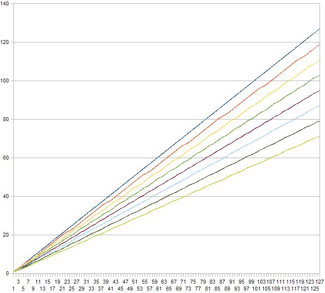
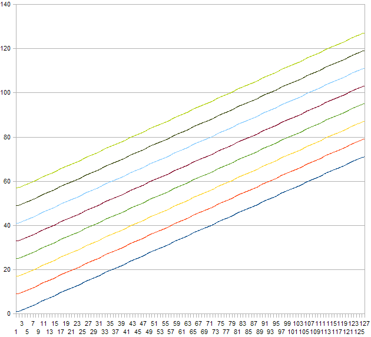

Every pad setting screen has common fields:
```
<Ch04: SnareH  >
Note:  D2    38
```
where:

* CH04:    - input number
* SnareH   - input name where H or B stands for Head or Bow (for even inputs)
             and R or E stands for Rim or Edge (for odd inputs),
* Note:    - pad setting name
* D2    38 - setting value

## <a name="Name"></a>Name
```
<Ch04:Snare1  H>
Name:Snare
```
Input name. Every input can have a custom Name set from a predefined list of names.
On Head/Bow inputs the custom name has cymbal 'H' appended at the end, on
Rim/Edge inputs the custom name has cymbal 'R' appended at the end.

## <a name="Disabled"></a>Disabled
```
<Ch04: SnareH  >
Disabled:    No
```
If you don't use the input set Set Disabled to Yes. Default is No (input is enabled).

## <a name="MNote"></a>MNote
```
<Ch04: SnareH  >
MNote: D2    38
```
Master note. You can use MNote to easily set all input's notes  in one place.
It shows the current Note of the input and if changed it sets Note, ANote, PNote
(and DBNote if it is a rim/edge input) to the same value.

## <a name="Note"></a>Note
```
<Ch04: SnareH  >
Note:  D2    38
```
Input's note. D2 is note name and 38 is MIDI note number.

## <a name="ANote"></a>ANote
```
<Ch04: SnareH  >
ANote: D2    38
```
Input's alternating note. If it is different from Note then the note values will
be alternating between Note and ANote for every hit. By default it is equal to Note.

## <a name="PNote"></a>PNote
```
<Ch04: SnareH  >
PNote: D2    38
```
Input's note for "pressrolls". If a "pressroll" is detected then the note values
will be taken from PNote rather than from Note/ANote. See also
[PressRoll Time](../miscellaneous-settings#PressRollTime)
in Miscellaneous settings.

## <a name="Channel"></a>Channel
```
<Ch04: SnareH  >
Channel:     10
```
Input's MIDI channel. Default is 10 on all channels.

## <a name="Function"></a>Function
```
<Ch04: SnareH  >
Function:Normal
```
Function of the input. It can be set to Normal, PrgChg or CutOff. Default is Normal.

When set to PrgChg it has no effect on Head/Bow inputs. On switch type Rim/Edge
inputs this option activates Program Change support.
To activate the Program Change support:

1. Configure the input either as a dual piezo/switch pad or as a Yamaha style 3
   zone cymbal.

2. On a Rim/Edge input set Function to PrgChg.

3. Set ANote to a number which will limit the Program Change lowest number.

4. Set PNote to a number which will limit the Program Change highest number.

Pressing the edge switch will send MIDI Program Change messages on each press in
the upwards direction between ANote and PNote values. Pressing the bell switch
(if the edge and bell switches are wired as in a Yamaha style 3 zone cymbal and
configured accordingly) will send MIDI Program Change messages on each press in
the downwards direction between ANote and PNote values. Of course, it doesn't
have to be a real Yamaha type 3 zone pad/cymbal, it just needs switches connected
to the rim/edge input as in a Yamaha type 3 zone cymbal, i.e. one switch connected
directly and the second switch connected over a 10k resistor. It will work with
only one switch as well but it will only cycle in upwards direction going to a
ANote value again after reaching PNote value. Sent kit (PC number + 1) is shown
on the LCD when Program Change message is sent.

When set to CutOff the 'ANote' setting changes it meaning to
'cut off' level - hits with velocities below level set in 'ANote' will not
trigger Note On/Off messages.

## <a name="Curve"></a>Curve
```
<Ch04: SnareH  >
Curve:  Log1
```
Hit level curve. Sets input signal strength to MIDI level adaptation function
for the input. Can be set to Linear, Log1, Log2, Log3, Exp1, Exp2, S1, S2,
Strong1, Strong2, Max.

## <a name="ComprLvl"></a>ComprLvl
```
<Ch04: SnareH  >
ComprLvl:     0
```
Compression level on the input. Can be set between 0 and 7. Here is an illustration
of the effect this setting has on a MIDI note velocity depending on the applied
compression level (0 - top line, 7 - bottom line) and input hit strength with a
Linear curve setting:



## <a name="LvlShift"></a>LvlShift
```
<Ch04: SnareH  >
LvlShift:     0
```
Level shift on the input. Can be set to 0, 8, 16, 24, 32, 40, 48 or 56. Here is
an illustration of the effect this setting has on a MIDI note velocity depending
on the applied level shift (0 - bottom line, 56 - top line) and input hit strength
with a Linear curve setting and compression level 7:



## <a name="Xtalk"></a>Xtalk
```
<Ch04: SnareH  >
Xtalk:        2
```
Crosstalk suppression level. Can be set between 0 (no crosstalk suppression) and
7 (strongest crosstalk suppression). If the drum kit has parasitic vibrations
transmitted from one pad to another it can trigger signals on pads which were not
hit thus producing false MIDI signals. Adjusting this setting you can try to
mitigate this problem. Be warned that with a poorly built kit the crosstalk
suppression will not help to avoid the problem.

## <a name="XtalkGrp"></a>XtalkGrp
```
<Ch04: SnareH  >
XtalkGrp:     0
```
Crosstalk suppression group of the input. Can be set between 0 and 7. By default
all inputs are placed into the same group meaning that the Xtalk setting will be
evaluated  against signals from all pads. If some of your pads are
physically/mechanically isolated you can place pads into 8 different Xtalk groups
so that the Xtalk setting only evaluated against within the same group thus
avoiding unnecessary suppression.

## <a name="Threshold"></a>Threshold
```
<Ch04: SnareH  >
Threshold:   30
```
For piezo inputs: Input threshold level. Sets at what minimum (relative electrical)
level a signal will be detected as a hit. This is one of the main settings
effecting overall performance of the drum kit and the best actual value depends
on types of pads used. It may take a while to find the best value.

For switch Rim/Edge inputs: Input switch threshold. Sets below which level the
switch is detected as hit/pressed.  Note that on the switch Rim/Edge inputs
actual velocity is determined by signal from a piezo on a Head/Bow input.
The best way to set a correct threshold on a switch input is to use MIDI-OX to
monitor 'aftertouch' MIDI messages. With a proper threshold value you should see
2 or 3 (dual zone or 3way/3 zone pad) 'aftertouch' on' MIDI messages when you
press the switch and 2 or 3 'aftertouch off' MIDI messages when you release the
switch.

## <a name="Gain"></a>Gain
```
<Ch04: SnareH  >
Gain:         4
```
Gain level for the input. Can be set between 0 and 8. Lower value makes the input
less sensitive, higher value makes the input more sensitive. Set it lower for
'hot' pads (pads which produce stronger electrical signals), set it higher for
'cold' pads (pads which produce weaker electrical signals).

## <a name="HiLvlAuto"></a>HiLvlAuto
```
<Ch04: SnareH  >
HiLvlAuto:  Yes
```
When set to Yes, MegaDrum tries to auto adjust HighLevel for the input. Can be
used for an initial setup to get a sense how 'hot' or 'cold' the pad is. After
this, set it to No and adjust HighLevel manually using the auto detected level
as a guidance.

## <a name="HighLevel"></a>HighLevel
```
<Ch04: SnareH  >
HighLevel:  855
```
High (top) level of the input. Signals with relative electrical levels between
Threshold and HighLevel will produce MIDI notes with velocities between 1 and 127
(provided both ComprLvl and LvlShift are set to 0). Any signals with relative
electrical levels above HighLevel will produce MIDI notes with velocity 127. The
further Threshold and HighLevel are apart the better, provided you can reliably
get MIDI notes with velocity 127 with strongest hits. Having said that, you will
lose almost no dynamics until when HighLevel-Threshold<200~300. If you set
HighLevel to maximum, 1023, and still easily get MIDI notes with velocity 127
you probably have a very 'hot' pad and you may lose hit dynamics. Try lowering
Gain. If it doesn't help will probably need to use a voltage divider on the input.
Don't be scared, a voltage divider is just a trim potentiometer which lowers
input signal.

## <a name="Retrigger"></a>Retrigger
```
<Ch04: SnareH  >
Retrigger:    8
```
Retrigger period in milliseconds for the input. Determines how many milliseconds
must pass after a previously detected signal for a new signal to be detected to
prevent a 'machine gun' effect or false triggering due to vibration after a hit.
As a Threshold setting this is one is one of the most important parameters and
it may take some time to find the best value. Ideally it should be set as low as
possible and let 'Dynamic Threshold' to combat the 'machine gun' and false
triggering. But if even with highest Dynamic Threshold Levels and
Dynamic Threshold Decay times you still get these unwanted effects you may need
to raise Retrigger level. On DIY pads and cymbals I have Retrigger set between
4 and 12 milliseconds. Setting it too high will prevent you from doing fast drum
rolls.

## <a name="DynLevelTime"></a>DynLevel and DynTime
```
<Ch04: SnareH  >
DynLevel:     5

<Ch04: SnareH  >
DynTime:     32
```
Dynamic Threshold level and Dynamic Threshold decay time for the input. Also two
very important parameters. Raising both DynLevel and DynTime will tell MegaDrum
to suppress false triggering (crosstalks between inputs, double triggering) harder.
Raising them too high may cause MegaDrum to miss some hits on fast/press rolls.
DynLevel sets how hard MegaDrum will try to suppress false triggering. DynTime
sets for how long MegaDrum will try to suppress false triggering. For most rubber
type pads/cymbals DynLevel between 8 and 15 and DynTime between 8 and 20 should
produce the best results. For mesh type pads it may be needed to raise DynTime
above 20 and up to 60.

## <a name="MinScan"></a>MinScan
```
<Ch04: SnareH  >
MinScan:     20
```
Minimum scan time for the input. Measured/shown in 1/10th of millisecond. Can be
set between 1 and 100 (0.1 - 10ms). When MegaDrum detects a signal above
Threshold/Dynamic threshold, it will keep sampling it for MinScan period of time
before marking the signal as registered and making it ready to be sent over MIDI
next MegaDrum scans (scan time is set by 'Latency') all channels for registered
signals.
Lowering it will improve Latency (MegaDrum latency is between Latency and and
Latency+MinScan) and may worsen level accuracy. Raising it will worsen Latency
and may improve level accuracy. Generally for rubber type pads/cymbals setting
MinScan to 20 (2ms) is enough for proper signal level detection. For mesh type
pads you may need to raise MinScan to 30~50 - the bigger mesh type pads the
higher MinScan is required for proper signal level detection..

## <a name="DualHead"></a>DualHead for Head/Bow input or Type for Rim/Edge inputs
```
<Ch04: SnareH  >
DualHead:   Yes
```
For Head/Bow inputs: Can be set to No, Yes or 3Way.
If set to No, Head/Bow and Rim/Edge inputs are treated as separate pads.
If set to Yes, Head/Bow and Rim/Edge inputs are treated as parts of the same
dual zone pad or as parts of the same 3 zone pad, e.g. Yamaha style 3 zone cymbals.
See more about 3 zone pads below in BNote and BThreshold settings.
If set to 3Way, Head/Bow and Rim/Edge inputs are treated as Bow and Bell inputs
of 3way pads, e.g. 3way Roland style cymbals, and the next Rim/Edge input is
treated as an edge input of the same pad.
```
<Ch04: SnareR  >
Type:     Piezo
```
For Rim/Edge inputs: Can be set as either Piezo or Switch. Sets the type of a
trigger connected to the input. You can set it as Switch only if the Head/Bow
input DualHead parameter is set to Yes or 3Way.

## <a name="3rdDsbld"></a>3rd Dsbld (only available on Rim/Edge inputs)
```
<Ch04: SnareH  >
3rd Dsbld:   No
```
If you don't use 3rd zone set Set 3rd Dsbld to Yes. Default is No (3rd zone is enabled).

## <a name="MBNote"></a>MBNote (only available on Rim/Edge inputs)
```
<Ch04: SnareR  >
MBNote:C#3   49
```
Master note for the 3rd zone/rim shot. You can use MBNote to easily set all
BNote, ABNote and PBNote  values in one place. It shows the current BNote and
if changed it sets BNote, ABNote and PBNote (but not DBNote) to the same value.

## <a name="BNote"></a>BNote (only available on Rim/Edge inputs)
```
<Ch04: SnareR  >
BNote: C#3   49
```
For piezo/switch/switch 3 zones pdas/cymbals: Note number for the 3rd zone of a
3 zone Yamaha style pad/cymbal.

For piezo/piezo dual zone pads: Note number for a rim shot. Set equal to a note
number of the rim to disable rim shot functionality. Note that this feature is
still experimental. Right settings for HighLevel on both the head and the rim
inputs is very important. Raising MinScan on both the head and the rim can also
improve rim shot reliability.

## <a name="ABNote"></a>ABNote (only available on Rim/Edge inputs)
```
<Ch04: SnareR  >
ABNote:C#3   49
```
3rd zone alternating note. If it is different from BNote then the note values
will be alternating between BNote and ABNote for every hit. By default it is
equal to BNote.

## <a name="DBNote"></a>DBNote (only available on Rim/Edge inputs)
```
<Ch04: SnareR  >
DBNote:C#3   49
```
For piezo/switch 2 or 3 zones pads/cymbals only. Dampened note value. If a
pad/cymbal is hit when the rim/edge switch is pressed then the note value is
taken from DBNote rather than from Note of the head/bow input. By default it is
equal to Note of the head/bow input.

## <a name="PBNote"></a>PBNote (only available on Rim/Edge inputs)
```
<Ch04: SnareR  >
PBNote:C#3   49
```
3rd zone's note for "pressrolls". If a "pressroll" is detected then the note
values will be taken from PBNote rather than from BNote/ABNote. See also
[PressRoll Time](../miscellaneous-settings#PressRollTime)
in Miscellaneous settings.

## <a name="DualMidPoint"></a>DualMidPoint (only available on Rim/Edge inputs)
```
<Ch04: SnareR  >
DualMidPoint 15
```
For dual piezo/piezo pads: Midpoint is used to fine tune separation between head
and rim hits. It can be set between 0 and 15. The higher the value the easier to
get rim hits and more difficult to get head hits and vice versa.
For dual piezo/switch pads this option is disabled.

## <a name="DualMidWidth"></a>DualMidWidth (only available on Rim/Edge inputs)
```
<Ch04: SnareR  >
DualMidWidth 15
```
For dual piezo/piezo pads: The width of signals for rim shots. It can be set
between 0 and 15. The higher the value the easier to get rim shots and more
likely to get false rim shots on head or rim hits and vice versa.
For dual piezo/switch pads this option is disabled.

## <a name="BThreshold"></a>BThreshold (only available on Rim/Edge inputs)
```
<Ch04: SnareR  >
BThreshold:  15
```
For piezo/switch/switch 3 zones pdas/cymbals:Input switch threshold for the 3rd
zone of a 3 zone Yamaha style pad/cymbal. Sets below which level the Bell switch
is detected as hit/pressed. This level must be lower than Threshold level of the
Rim/Edge input of a switch type trigger. If the connected pad is dual zone
piezo/switch type or a 3way Roland cymbal, BThrshold must be set to 0 to prevent
false triggering of Bell notes or alternatively set all Bell Notes
(BNote, ABNote, PBNote) equal to the Edge/Rim Notes.
For dual piezo/piezo pads this option is disabled.
