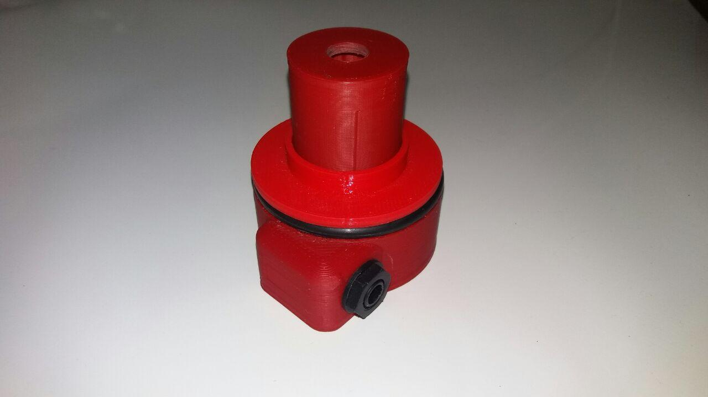
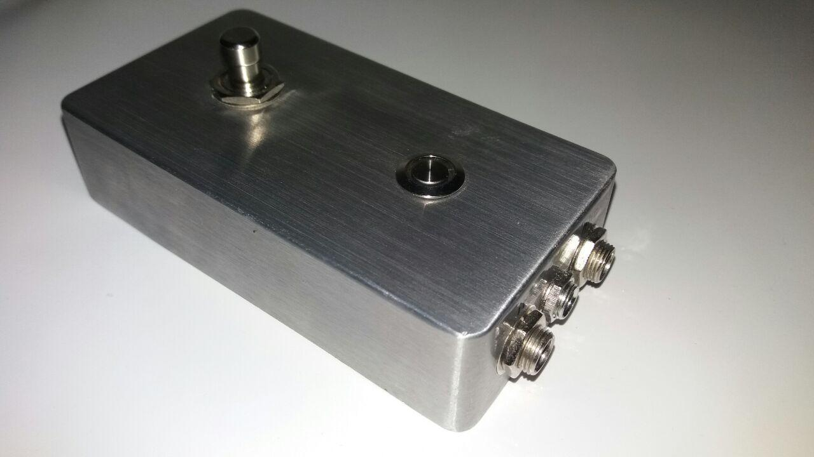

SmartHHC is a device to control the HiHat cymbal connected to your electronic
drum module.
Currently only Roland and ATV are supported, more would be added in future.
There may be different version of the hardware, currently it's subdivided in
2 components:

## Sensor

The sensor support is placed under the cymbal, to take track of the opening position.

## Pedal

The pedal is used for the auto-learning process and fixed position switching,
like a virtual clutch when using a double pedal.

## Software

The main application is written with [Qt C++ Framework] to setup the SmartHHC
controller, currently available for Linux. Android, macOS and Windows versions are planned.

It communicates with the device via USB serial port or Bluetooth via [commands],
to get and set the open, close and fixed pedal setting values, plus the
operation curve for response fine settings.

[commands]:         commands
[Qt C++ Framework]: https://www.qt.io/
